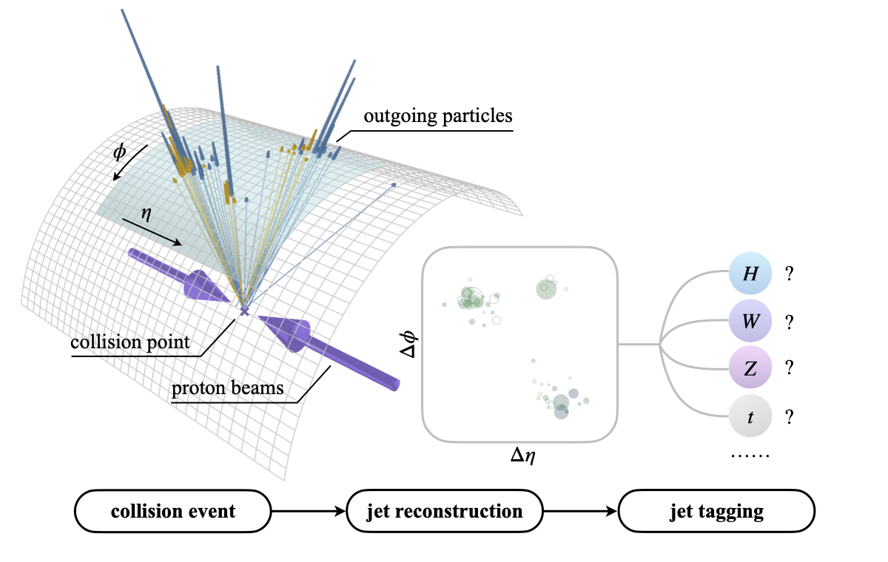
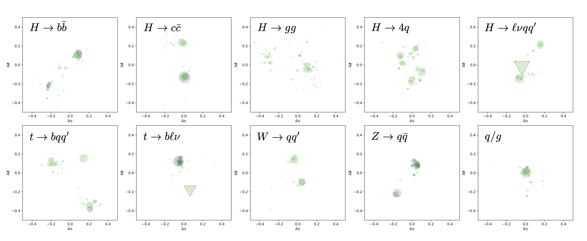
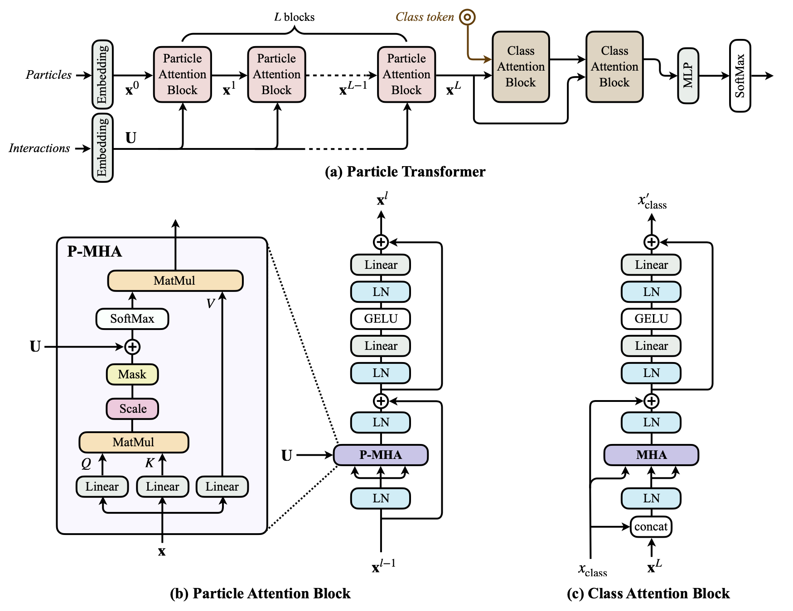

# Particle Transformer

This repo is the official implementation of "[Particle Transformer for Jet Tagging](https://arxiv.org/abs/2202.03772)". It includes the code, pre-trained models, and the JetClass dataset.



## Updates

### 2023/07/06

We added a [helper function](dataloader.py) to read the JetClass dataset into regular numpy arrays. To use it, simply download the file [dataloader.py](dataloader.py) and do:

```python
from dataloader import read_file

x_particles, x_jet, y = read_file(filepath)
```

The return values are:

- `x_particles`: a zero-padded numpy array of particle-level features in the shape `(num_jets, num_particle_features, max_num_particles)`.
- `x_jets`: a numpy array of jet-level features in the shape `(num_jets, num_jet_features)`.
- `y`: a one-hot encoded numpy array of the truth lables in the shape `(num_jets, num_classes)`.

## Introduction

### JetClass dataset

**[JetClass](https://zenodo.org/record/6619768)** is a new large-scale jet tagging dataset proposed in "[Particle Transformer for Jet Tagging](https://arxiv.org/abs/2202.03772)". It consists of 100M jets for training, 5M for validation and 20M for testing. The dataset contains 10 classes of jets, simulated with [MadGraph](https://launchpad.net/mg5amcnlo) + [Pythia](https://pythia.org/) + [Delphes](https://cp3.irmp.ucl.ac.be/projects/delphes):



### Particle Transformer (ParT)

The **Particle Transformer (ParT)** architecture is described in "[Particle Transformer for Jet Tagging](https://arxiv.org/abs/2202.03772)", which can serve as a general-purpose backbone for jet tagging and similar tasks in particle physics. It is a Transformer-based architecture, enhanced with pairwise particle interaction features that are incorporated in the multi-head attention as a bias before softmax. The ParT architecture outperforms the previous state-of-the-art, ParticleNet, by a large margin on various jet tagging benchmarks.



## Getting started

### Download the datasets

To download the JetClass/QuarkGluon/TopLandscape datasets:

```
./get_datasets.py [JetClass|QuarkGluon|TopLandscape] [-d DATA_DIR]
```

After download, the dataset paths will be updated in the `env.sh` file.

### Training

The ParT models are implemented in PyTorch and the training is based on the [weaver](https://github.com/hqucms/weaver-core) framework for dataset loading and transformation. To install `weaver`, run:

```python
pip install 'weaver-core>=0.4'
```

**To run the training on the JetClass dataset:**

```
./train_JetClass.sh [ParT|PN|PFN|PCNN] [kin|kinpid|full] ...
```

where the first argument is the model:

- ParT: [Particle Transformer](https://arxiv.org/abs/2202.03772)
- PN: [ParticleNet](https://arxiv.org/abs/1902.08570)
- PFN: [Particle Flow Network](https://arxiv.org/abs/1810.05165)
- PCNN: [P-CNN](https://arxiv.org/abs/1902.09914)

and the second argument is the input feature sets:

- [kin](data/JetClass/JetClass_kin.yaml): only kinematic inputs
- [kinpid](data/JetClass/JetClass_kinpid.yaml): kinematic inputs + particle identification
- [full](data/JetClass/JetClass_full.yaml) (_default_): kinematic inputs + particle identification + trajectory displacement

Additional arguments will be passed directly to the `weaver` command, such as `--batch-size`, `--start-lr`, `--gpus`, etc., and will override existing arguments in `train_JetClass.sh`.

**Multi-gpu support:**

- using PyTorch's DataParallel multi-gpu training:

```
./train_JetClass.sh ParT full --gpus 0,1,2,3 --batch-size [total_batch_size] ...
```

- using PyTorch's DistributedDataParallel:

```
DDP_NGPUS=4 ./train_JetClass.sh ParT full --batch-size [batch_size_per_gpu] ...
```

**To run the training on the QuarkGluon dataset:**

```
./train_QuarkGluon.sh [ParT|ParT-FineTune|PN|PN-FineTune|PFN|PCNN] [kin|kinpid|kinpidplus] ...
```

**To run the training on the TopLandscape dataset:**

```
./train_TopLandscape.sh [ParT|ParT-FineTune|PN|PN-FineTune|PFN|PCNN] [kin] ...
```

The argument `ParT-FineTune` or `PN-FineTune` will run the fine-tuning using [models pre-trained on the JetClass dataset](models/).

## Citations

If you use the Particle Transformer code and/or the JetClass dataset, please cite:

```
@InProceedings{Qu:2022mxj,
    author = "Qu, Huilin and Li, Congqiao and Qian, Sitian",
    title = "{Particle Transformer} for Jet Tagging",
    booktitle = "{Proceedings of the 39th International Conference on Machine Learning}",
    pages = "18281--18292",
    year = "2022",
    eprint = "2202.03772",
    archivePrefix = "arXiv",
    primaryClass = "hep-ph"
}

@dataset{JetClass,
  author       = "Qu, Huilin and Li, Congqiao and Qian, Sitian",
  title        = "{JetClass}: A Large-Scale Dataset for Deep Learning in Jet Physics",
  month        = "jun",
  year         = "2022",
  publisher    = "Zenodo",
  version      = "1.0.0",
  doi          = "10.5281/zenodo.6619768",
  url          = "https://doi.org/10.5281/zenodo.6619768"
}
```

Additionally, if you use the ParticleNet model, please cite:

```
@article{Qu:2019gqs,
    author = "Qu, Huilin and Gouskos, Loukas",
    title = "{ParticleNet: Jet Tagging via Particle Clouds}",
    eprint = "1902.08570",
    archivePrefix = "arXiv",
    primaryClass = "hep-ph",
    doi = "10.1103/PhysRevD.101.056019",
    journal = "Phys. Rev. D",
    volume = "101",
    number = "5",
    pages = "056019",
    year = "2020"
}
```

For the QuarkGluon dataset, please cite:

```
@article{Komiske:2018cqr,
    author = "Komiske, Patrick T. and Metodiev, Eric M. and Thaler, Jesse",
    title = "{Energy Flow Networks: Deep Sets for Particle Jets}",
    eprint = "1810.05165",
    archivePrefix = "arXiv",
    primaryClass = "hep-ph",
    reportNumber = "MIT-CTP 5064",
    doi = "10.1007/JHEP01(2019)121",
    journal = "JHEP",
    volume = "01",
    pages = "121",
    year = "2019"
}

@dataset{komiske_patrick_2019_3164691,
  author       = {Komiske, Patrick and
                  Metodiev, Eric and
                  Thaler, Jesse},
  title        = {Pythia8 Quark and Gluon Jets for Energy Flow},
  month        = may,
  year         = 2019,
  publisher    = {Zenodo},
  version      = {v1},
  doi          = {10.5281/zenodo.3164691},
  url          = {https://doi.org/10.5281/zenodo.3164691}
}
```

For the TopLandscape dataset, please cite:

```
@article{Kasieczka:2019dbj,
    author = "Butter, Anja and others",
    editor = "Kasieczka, Gregor and Plehn, Tilman",
    title = "{The Machine Learning landscape of top taggers}",
    eprint = "1902.09914",
    archivePrefix = "arXiv",
    primaryClass = "hep-ph",
    doi = "10.21468/SciPostPhys.7.1.014",
    journal = "SciPost Phys.",
    volume = "7",
    pages = "014",
    year = "2019"
}

@dataset{kasieczka_gregor_2019_2603256,
  author       = {Kasieczka, Gregor and
                  Plehn, Tilman and
                  Thompson, Jennifer and
                  Russel, Michael},
  title        = {Top Quark Tagging Reference Dataset},
  month        = mar,
  year         = 2019,
  publisher    = {Zenodo},
  version      = {v0 (2018\_03\_27)},
  doi          = {10.5281/zenodo.2603256},
  url          = {https://doi.org/10.5281/zenodo.2603256}
}
```
